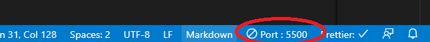
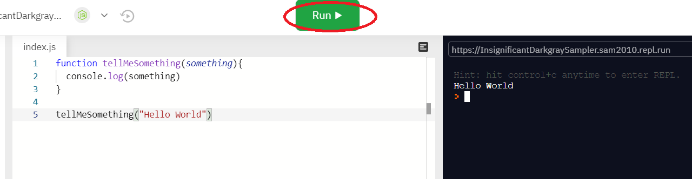
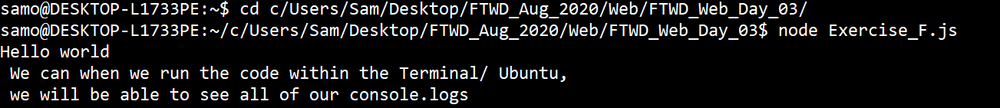

# Christian Action :rocket:

The exercise repos come with come boilerplate code, if you're confident and do not wish to follow these guidelines feel free to remove them!

### Main Topics :zap:

- Manipulating the DOM
- Dom Event Listeners

### Directions :flashlight:

- Go to the LMS and follow the exercises:
  [Document Object Model](https://learn.xccelerate.co/unit/view/id:6032)
  [Events](https://learn.xccelerate.co/unit/view/id:6033)

### How it works :open_book:

Directions: Clone this repository, open the files and fill them out according to the directions

Method One:

- Opening index.html:

  - Right click on index.html
  - Hover over "Open with..."
  - Select your code editor (to change code) OR chrome (to see it)
  - Whenever you change your code, make sure to refresh the chrome page

  Method Two:

- Opening index.html from VS code:

  - Follow method one and open your file within VS code
  - Install the extension Live Server
  - Right click on the index.html and then select open with Live Server, when you are finished, click the close server button on the bottom right of VS code.

  

### Running JavaScript Code:

Method One:

- Open your browser and navigate to repl.it
- Create a JavaScript room, you will be able to code and execute the script within the browser by pressing the Run command

  

Method Two:

- Open an instance of the Terminal / Ubuntu
- Use the cd command to navigate to the directory that contains your JavaScript file that you would like to run
- Execute the file using the node command, followed by the file name: node exercise_a.js

  

  ## Practice Questions :telescope:

  In practice.js

- [ ] Practice Accessing the DOM

- [ ] Practice Manipulating the DOM

- [ ] Practice Events && Event listeners

## Exercises Due :athletic_shoe:

Remember to link your JavaScript files to HTMl documents to target html elements. 

- [ ] Exercise A: Access a Tag

- [ ] Exercise B: Getting all Elements

- [ ] Exercise C: Getting Child Elements

- [ ] Exercise D: Changing Flowershop Website

- [ ] Bonus Exercise: Change the documents style with a button: [Link to LMS for further explanation](https://learn.xccelerate.co/unit/view/id:2105)

- [ ] Finish the 'What is one thing that I learned from doing this project?' in the readme

### Tips :tipping_hand_woman:

- We highly encourage you to follow practice the exercises; reading about code is not always enough, sometimes it's also important to practice implementing the specific steps. Don't worry if it feels difficult - that's normal. The important thing is to keep going, even when it feels hard :relaxed:

- If you get stuck, try to break down the problem. What small thing can you figure out first? Remember, instructors have a no touching your key board rule (we can help guide you, but won't debug for you!). Part of being a software engineer IS solving problems. It's a marathon, not a sprint :running_woman:

- Other debugging tips
  - [ ] Write down the logic of your code
  - [ ] Re-read documentation
  - [ ] Look at example code on github
  - [ ] Go slow. Do one thing at a time. You got this :muscle:

## What is one thing that I learned from doing this project? :books:

(Fill whatever you would like here)
